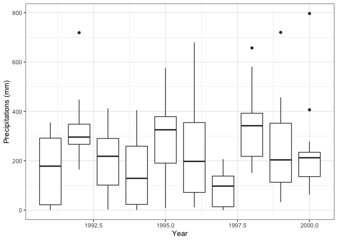

simpleRCRU
================

[](https://travis-ci.org/ahmad-alkadri/simpleRCRU)

Just like its name implies, this package aims to help working with CRU
datasets in a simpler, or more straightforward way. To achieve this,
**simpleRCRU** wraps around two primary packages: namely, *ncdf4* and
*raster*. However, unlike its superiors, **simpleRCRU**’s sole objective
is to obtain the climate data from the CRU datasets as quick as
possible.

## Background

In 2017, during my internship with [CIFOR (Center for International
Forestry Research)](http://www.cifor.org), I was tasked to obtain the
climate data from CRU datasets for several regions in Kalimantan island,
Indonesia. I wasn’t very familiar with CRU, nor with packages such as
*raster* or *ncdf4*, but I was curious. It took me days to finally got
the hang of it, and about hours to finally wrote the one function that I
included here: *extractcru()*.

## Methods

The reason why I wrote this package (or, back then, these functions) is
simple: working with *raster* for obtaining the climate data from CRU
datasets is simply not simple at all. Sure, *raster* is very powerful
for working with CRU datasets, but I only wanted to obtain some simple
climate data. The kind of information that I needed was just, for
example, the monthly **precipitation** data for Cilacap (a little town
in Indonesia where I grew up, more on that later), during the year
**1991**. With *extractcru* function, all I needed to do is typing:

``` r
library(simpleRCRU)
library(R.utils)

# Download the climate dataset
download.file("https://crudata.uea.ac.uk/cru/data/hrg/cru_ts_4.02/cruts.1811131722.v4.02/pre/cru_ts4.02.1991.2000.pre.dat.nc.gz",
              destfile = "cru_ts4.02.1991.2000.pre.dat.nc.gz")

# Unzipping the dataset
gunzip("cru_ts4.02.1991.2000.pre.dat.nc.gz",
       remove = FALSE, overwrite = TRUE)

file <- ("cru_ts4.02.1991.2000.pre.dat.nc")
year <- 1991 #Requested year
var <- "pre" #Variable code for precipitation
lon <- 109.01 #Longitude of Cilacap town
lat <- -7.74 #Latitude of Cilacap town
datres <- extractcru(file, lon, lat, var, year)
file.remove("cru_ts4.02.1991.2000.pre.dat.nc")
```

    ## [1] TRUE

``` r
print(datres)
```

    ##      pre Year     Month    lon   lat
    ## 1  333.9 1991   January 109.01 -7.74
    ## 2  294.4 1991  February 109.01 -7.74
    ## 3  213.1 1991     March 109.01 -7.74
    ## 4  290.7 1991     April 109.01 -7.74
    ## 5   54.3 1991       May 109.01 -7.74
    ## 6   26.7 1991      June 109.01 -7.74
    ## 7    6.6 1991      July 109.01 -7.74
    ## 8    0.0 1991    August 109.01 -7.74
    ## 9    1.0 1991 September 109.01 -7.74
    ## 10 143.1 1991   October 109.01 -7.74
    ## 11 355.4 1991  November 109.01 -7.74
    ## 12 279.2 1991  December 109.01 -7.74

Next, we can plot this very easily, with:

``` r
datres$Monthnum <- c(1:12)
plot(x = datres$Monthnum, y = datres$pre, xlab = "Month", ylab = "Monthly precipitation (mm)")
lines(x = datres$Monthnum, y = datres$pre)
```

<!-- -->

Now let’s say that we’d like to visualize the yearly precipitations in
the town of Cilacap from 1991 to 2000 For that, it’d be better to use
boxplot. To do this, we simply write:

``` r
gunzip("cru_ts4.02.1991.2000.pre.dat.nc.gz",
       remove = FALSE, overwrite = TRUE)
file <- "cru_ts4.02.1991.2000.pre.dat.nc" #Precipitation dataset from CRU
var <- "pre" #Variable code for precipitation
lon <- 109.01 #Longitude of Cilacap town
lat <- -7.74 #Latitude of Cilacap town
years <- 1991:2000 #Requested years

datres2 <- extractcru(file, lon, lat, var, year = years)
file.remove("cru_ts4.02.1991.2000.pre.dat.nc")
```

    ## [1] TRUE

``` r
library(ggplot2) #Loading ggplot2 package, easier to work with boxplot
ggplot(data = datres2, aes(x = Year, y = pre, group = Year))+geom_boxplot()+
  xlab("Year")+ylab("Precipitations (mm)")+theme_bw()
```

<!-- -->

And finally, to export the result, for example the precipitation data
from 1991 to 2000 above, we simply write:

``` r
write.csv(datres2, file = "pre_1991_2000_Cilacap.csv")
```

## Future Works

I’ve finished my internship in CIFOR since 2017, and to be honest, I
haven’t touched these functions again since then. It’s only yesterday
that I finally stumbled upon them again on my laptop, and thus I decided
to upload them here. I have some ideas on developing this package in the
future, including but not limited to:

  - adding capabilities for extracting the data from several coordinates
    at the same time in a single function
  - adding capabilities for extracting and interpolating data for a
    given area, not just a single point coordinate
  - plotting

If you have any advice, inputs, or even if you want to contribute,
please don’t hesitate to contact me at <ahmad.alkadri@outlook.com>. Many
thanks\!
